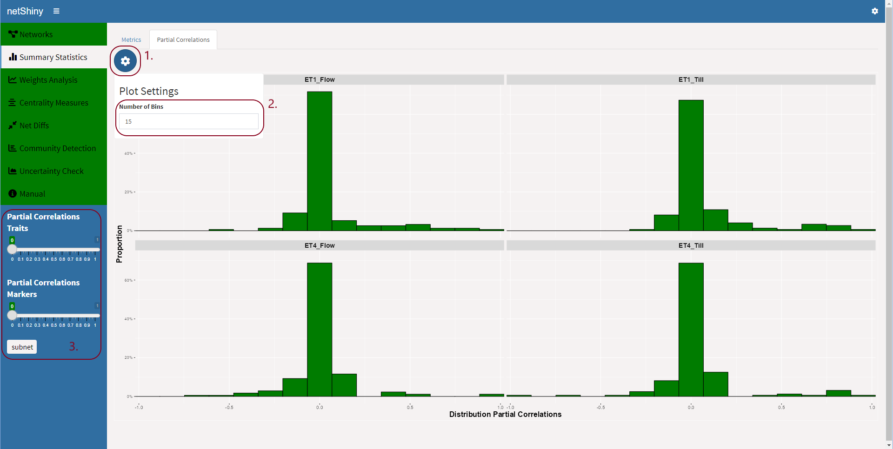
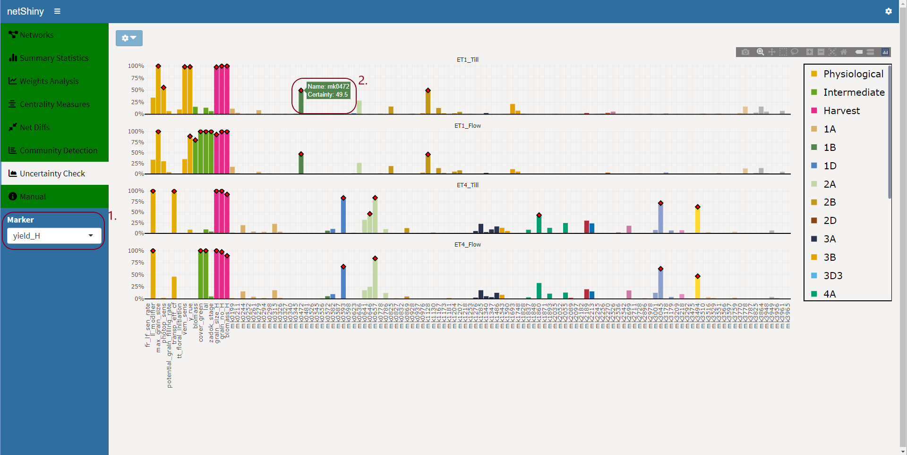

## <span style="color:#007c00">netShiny Manual</span>


### Usage

netShiny(Net.obj  = NULL, 
         mapping   = NULL, 
         resamples = NULL)

### Arguments

#### Net.obj

A list of (sparse) matrices corresponding to the networks that need to be visualized. Net.obj can also be a list of dataframes with data to be used to reconstruct networks. Or, Net.obj can be a combination of (sparse) matrices and dataframes. If items in list are names, these names will be used, otherwise automatic names will be generated.

#### mapping

A dataframe containing order for each node. There should be a column with the names of the nodes and a column with the corresponding group that the nodes belong to. The app will automatically choose the column representing the grouping of the nodes by looking at the first two columns, and choosing the column with the less number of factor levels as the columns containing the grouping of the nodes.

#### resamples

If an user has resampling information corresponding to the networks to be visualized the user can also include this in the function, which will incorporate it into the app.

### Details

This function opens the shiny app, netShiny. All of the arguments in netShiny are optional, so netShiny can be called without any arguments. Users are prompted with a series of modal dialogs after running the netShiny function. The first modal dialog gives users the possibility to upload files to the app and show the dataframes that already uploaded in a datatable. Users can choose files which contain information to reconstruct networks from them. The next modal dialog let users reconstruct networks using the dataframes that were uploaded. netShiny uses the functions netphenogeno and selectnet from the package netgwas for graph structure learning from non-Gaussian data. The next modal let users optionally choose a file containing the ordering of the nodes. If a dataframe containing the ordering of the nodes was already passed to mapping argument, this modal will visualize this in a datatable. The last modal let users choose the mode they want the app to run in, GxE (Genetic-by-Environment) or general mode. In GxE mode the language used in netShiny is more Genetic-by-Environment related. Users need to input the number of traits if GxE mode is chosen, and optionally, manually input a grouping for the traits.

```{r eval=FALSE}
ET1_Narrabri_1998_Z21 <- read.csv("ET1_Narrabri_1998_Z21.csv", header = TRUE)
ET1_Narrabri_1998_Z65 <- read.csv("ET1_Narrabri_1998_Z65.csv", header = TRUE)
ET4_Narrabri_2002_Z21 <- read.csv("ET4_Narrabri_2002_Z21.csv", header = TRUE)
ET4_Narrabri_2002_Z65 <- read.csv("ET4_Narrabri_2002_Z65.csv", header = TRUE)
```

In netShiny, users can either input the adjacency/weighted matrices in netShiny, or pass data that still needs to be estimated. We will start with the first way, which is to pass data that still need to be estimated.

```{r eval=FALSE}
df_list <- list(ET1_Till = ET1_Narrabri_1998_Z21,
                ET1_Flow = ET1_Narrabri_1998_Z65,
                ET4_Till = ET4_Narrabri_2002_Z21,
                ET4_Flow = ET4_Narrabri_2002_Z65)
netShiny(Net.obj = df_list)
```

1. Estimate graph structure using netShiny.

If users have the data loaded as dataframes in netShiny, users can pass the data by saving all of the dataframes in a list. Then, running the function and pass the list containing the dataframes as the Net.ob argument.

The argument Net.obj can be either a list of dataframes that need to be used for network reconstruction or a list of adjacency matrices. The mapping argument needs to be a dataframe containing a column with the names of the nodes and another column with the grouping that the nodes belong to. The resamples argument should be a list, where each entry of the list is also a list containing resampled adjacency matrices for a network.

None of the arguments are required, or dependent on each other. So, users can access the netShiny app by running the netShiny() function with or without arguments in R. If the function is ran without arguments, users can use the built-in functionality in netShiny to browse for the files they want to use for network reconstruction. Network reconstruction is done using the function netphenogeno() from the netgwas package \cite{Behrouzi2017, behrouzi2017detecting} which can be used for graph structure learning for non-Gaussian data. Then, optimal networks are chosen by using the function selectnet(), also from the netgwas package, which chooses an optimal network using an information criterion. 

## Case Study: Simulated Australian Wheat

To demonstrate the practicality of netShiny, we conducted a case study where we utilized netShiny to analyze and visualize the simulated Australian wheat phenotyping data \cite{bustos2019} using the well-known Agricultural Production Systems sIMulator (APSIM) \cite{KEATING2003267}. The data contain 2 different environment types with contrasting water deficiency, no drought and severe drought starting early during the growing season, at two different time stages, tillering and flowering, totalling four different factor levels. The data consists of 20 traits, and 308 genetic markers. The traits are divided into 12 physiological traits, 4 intermediate traits and 4 harvest traits. A more detailed description of the data can be found in \cite{bustos2019combining, bustos2019}. For this purpose, the no drought environment was called ET_1, and the tillering and flowering stage for this environment were denoted as ET1_Till and ET1_Flow, respectively. The severe drought starting early during the growing season was called ET_4, and the tillering and flowering stage for this environment were denoted as ET4_Till and ET4_Flow, respectively. In the next sections, we will show how we carried out the case study using netShiny.

## Data Processing

We start by running netShiny() without any arguments in R and use netShiny built-in functionality to load in files. 

```{r eval=FALSE}
netShiny()
```

After running the function, the app opens and prompts users to upload files for network reconstruction since no arguments were provided. Users need to choose from one of the different data formats. netShiny gives users the option to specify for each file separately whether the file has a header, the separator and quote. We upload four files, two for each environment (ET1 and ET4) at Tillering stage and Flowering stage. Users can also choose to exclude columns from the uploaded files. Since the first two columns are not important for the case study, we excluded them for each of the files, as can be seen in Figure \ref{fig:startup_1} for ET4_Till.csv. 

Next, users need to choose method(s) they want to use for network reconstruction. If users choose multiple methods, netShiny will run each method on all the files. This gives users the possibility to compare different methods against each other on the same file. As we stated, netShiny uses the functions netphenogeno() and selectnet() from the netgwas package for network reconstruction and selection of an optimal network, respectively. The netphenogeno() can reconstruct networks using three different methods: Gibbs sampling, approximation method, and a nonparanormal approach. If needed, users can also specify each argument of the netphenogeno() and selectnet() functions. An example of this can been seen in Figure \ref{fig:startup_2} where the Gibbs sampling method is chosen. 

If some of the files do not run successfully, netShiny will give users a notification and show which files did not run properly. Users can go back to upload a different file, choose different options for the file upload, or just continue with the files that have run successfully. 

Next, users can optionally upload a file that contains the ordering of the node. The file should contain a column with the names of the nodes and another column specifying which group the nodes belong to. In this case, there should be a column with the names of the markers and another column specifying in which chromosome a marker lays in. In Figure \ref{fig:startup_3} a file containing the ordering for the nodes is uploaded. netShiny will only look at the first two columns and ignore the other columns. Here too users can change quote, separator, header, and exclude columns for the uploaded files.

For the last step of processing the data, netShiny prompts user with a modal to choose which mode to run netShiny in. We will use the GxE (Genetic-by-Environment) mode for this case study. If this mode is chosen, users need to specify the number of traits. We will input 20. Optionally, users can change the names of the networks that were reconstructed and provide grouping for the traits if these were not specified in the mapping file. We specify the grouping as Physiological:12, Intermediate:4, Harvest:4, which means 12 Physiological traits, 4 Intermediate traits, and 4 Harvest traits. In Figure \ref{fig:startup_4} it shows the modal after choosing names, number of traits, and trait grouping.  

The order of the columns is not important for the file containing the mapping of the nodes, netShiny will automatically detect, using the first two columns, which column contains the nodes, and which one contains the grouping. 


The netShiny interface is divided into tabs that users can easily navigate. In the following sections we walk through each one of these tabs and explain what information the tabs are meant to convey, using the data we explained in the previous section. 

## Networks Tab
*
After successfully processing the data, the **Networks** tab is the first tab that users see. This tab is further divided into two subtabs; **networks** and **matrices**, with **networks** subtab selected initially.

### Networks Subtab

```{r networks_susbtab1, echo = FALSE, fig.cap = cap, out.width = '100%'}
knitr::include_graphics("networks_ET1_Flow_ET4_Flow.png")
cap <- "Figure 1. The Networks tab, at the networks subtab."
```

Herein, two network are shown simultaneously, with the common nodes of the two networks in the same relative position. The nodes in the graphs are colored to the group that they belong to. The nodes are interactive, giving users the ability to individually reposition each node to their liking. The edges are colored red if the weight of the edge is negative and blue otherwise. The thickness of the edge depends on the absolute value of the weight of the edge; the bigger the absolute value, the thicker the line. All of the nodes shown are nodes that are non-isolated, which are nodes that have at least one connection. Nodes that are isolated are not shown.

There are a plethora of options on what users can do. First, users can interactively change which networks to show in the right and left panel by using the two drop-down menus denoted "left panel" and "right panel" (1). Users can choose to only highlight nodes that belong to a certain group, by choosing the group from the drop-down menu on each of the panels.

There are two ways to interactively create subnetworks in netShiny: by imposing a threshold on the weights of the edges, or by selecting only certain nodes to create subnetworks from. Users can select a threshold for the edges in networks. In the GxE mode, there are two sliders, one controlling the weights of the between markers and markers only, and one controlling the weights between traits to traits, and traits to markers. In the General mode, there is only one slider controlling all of the weights. Choosing a threshold, removes all of the edges that their absolute value are below the selected threshold. Instead of creating subnetworks based on the weights of the edges, users can also create subnetworks by only selecting a subset of nodes, by clicking on the "subnet" button. This then create a subnetwork based only on the selected nodes. It is good to point out, that this option only show edges that are one away from the selected nodes. For example, yield_H was selected as the sole node to create a subnetwork. yield_H has a connection with biomass_H, and biomass_H has a connection with mk1000 whereas yield_H does not. In the subnetwork, where yield_H is the only node selected, the connection between biomass_H and mk1000 will not be shown since this connection is two away from yield_H.


The print button, basically, takes a screenshot of the two networks exactly how they are being shown. After clicking the button, a dialog will show such that users can choose the destination and file name of the picture.

```{r networks_susbtab2, echo = FALSE, fig.cap = cap, out.width = '100%'}
knitr::include_graphics("networks_ET1_Flow_ET4_Flow.png")
cap <- "Figure 1. The options available for the customization of the networks."
```

There are many options where users can customize the networks to their liking. By clicking on the "customize" button, a pop-up dialog will show, with all the options for users to customize. For the nodes, users can choose from the list which contains all of th available nodes, which nodes they want to customize. In the GxE mode, users can choose to only select all of the traits, or all of the markers. Users can change the color, the size, and the font size of the nodes interactively. Users can also choose to show/hide the isolated nodes. In the GxE mode, users can choose to show/hide the markers or traits nodes, individually. There is also a "Reset to default" option, where the networks will return how it was before the changes were applied to them. Next, users can also choose to curve the edges in the networks, by moving the slider, the higher the value, the more curved the edges will be. Next, users can also change the layout algorithm used for the nodes. All of the layout algorithms used are from the igraph package. The default option is "Automatic", which uses the "layout_nicely" option from the igraph package. If the "Tree" option is selected, users are prompted to also select the root node(s). Users can choose which nodes to make root by either inputting the node by their names, or by the index number of the nodes in the dataset. If multiple nodes is selected, users need to separate the options by a space.

```{r, echo=FALSE,out.width="50%", out.height="20%",fig.cap="caption",fig.show='hold',fig.align='center'}
knitr::include_graphics(c("networks_ET1_Flow_ET4_Flow.png","partial_correlations_subtab.png"))
``` 

Lastly, if users double click on one of the nodes, it will redirect users to the Weight Analysis tab, with the double-clicked node selected.


### Matrices Subtab

```{r adjacency_matrices_subtab, echo = FALSE, fig.cap = cap, out.width = '100%'}
knitr::include_graphics("networks_ET1_Flow_ET4_Flow.png")
cap <- "The Networks tab, at the matrices subtab."
```

Herein, plots depicting the adjacency matrices are shown. This way, a pattern of networks can be easily seen. The plots are also colored according to the weights. Users can hover on the plots to get more information, for example, which entry is currently being hovered on, and the value of this pairwise connection. Users can also zoom in on the plots. Lastly, users can interactively choose which networks and how many to show by clicking on the menu and selecting which networks to show.

## Summary Statistics Tab

In this tab, summary information about the networks are given. This tab is further subdivided into two subtabs; Metrics and Weight Distribution, or Partial Correlations, if the mode is GxE.

### Metrics

```{r metrics_subtab, echo = FALSE, fig.cap = cap, out.width = '100%'}
knitr::include_graphics("networks_ET1_Flow_ET4_Flow.png")
cap <- "The Summary Statistics tab, at the metrics subtab."
```

The first subtab is the Metrics subtab. Herein, the default plots that are shown are the number of edges, number of nodes, the average clustering coefficient, and the global clustering coefficient for all the networks. This gives users the ability to easily compare these metrics across all the networks. The number of nodes represent the number of non-isolated nodes. Comparing the number of edges and nodes across networks can give users an indication on the density of the networks. For a node, all the other nodes it has a connection with are called its neighbors \cite{bondy1976graph}. Clustering coefficient measures the tendency for a node's neighbors to be connected to each other \cite{Watts1998}. The clustering coefficient that is visualized in the plot is the global clustering coefficient and the average clustering coefficient, which give an indication on how clustered a network is \cite{opsahl2013triadic, Watts1998}. For both the global clustering coefficient and average clustering coefficient the weights of the edges are ignored. In this subtab it is also possible for users to interactively set a threshold on the weights of the edges, which will then be reflected in the visualizations of the metrics. Users can also choose to select only a few nodes via the subnetwork option.

By default, we only visualize 4 metrics even though there are many other metrics that can be applied to networks. Instead, netShiny affords users the flexibility to manually add functions that they want to apply to the networks. This way we avoid the problem of visualizing many metrics that may not be important to some users and excluding metrics that may be important to other users. Users can manually add functions in the Add statistic bar. The function needs to be able to be applied to an igraph graph object. Users can include the arguments of the function which they need to separate by commas (,). Adding multiple functions is also possible, users can do this by separating the functions with semicolons (;). An example of theMetrics subtab is shown in Figure \ref{fig:metrics} where we manually add two extra metrics, edge density and mean distance. A path exists between two nodes if there are a sequence of edges connecting these two nodes. The shortest path between two nodes is the path between these two nodes with the least number of nodes you must go through. Mean distance is the average path length of all the shortest distances in a network, and edge density is the proportion of the number of edges and the possible number of edges in a network.

### Weights Distribution/Partial Correlations

```{r weights_distribution_subtab, echo = FALSE, fig.cap = cap, out.width = '100%'}
knitr::include_graphics("networks_ET1_Flow_ET4_Flow.png")
cap <- "The Summary Statistics tab, at the partial correlations subtab."
```

This tab gives an overview of a certain trait or marker for all of the environments. For the trait or marker that is chosen, it will show which other markers and traits this chosen marker/trait has connection with, and it also shows you the strength of the partial correlation that the chosen marker/trait has with the other markers and traits. If a dataframe that maps markers to chromosomes is passed in the “map_dat” argument, the markers will be colored according to the chromosome that they belonged to.

## Weights Analysis Tab

```{r weights_analysis_tab, echo = FALSE, fig.cap = cap, out.width = '100%'}

cap <- "The Weights Analysis tab."
```

Next, we have the Weights Analysis tab. Herein, users can visualize the connections of a node across all the given factor levels. The connections are represented as a barplot. Each bar in the plot represents a connection that the chosen node has, and the height of the bars correspond to the weight of the connections. The weights of the connections can be really low, especially in GxE applications, making it sometimes difficult to see if a bar is present or not. To help with this, there are red dots on each bar which makes the connections clear. The plot itself is also interactive where user can hover on top of the bars and get information about a connection.  

An example of the Weight Analysis tab is shown in Figure \ref{fig:weights_analysis} where the node biomass_H is chosen and its connections visualized. Here the height of the bars corresponds to the partial correlations of the connections. The bars in the plot are coloured according to the corresponding node's grouping. Thus, in this case, the bars are colored according to the grouping of the trait or in which chromosome a marker was in. The connections of biomass_H is visualized across the levels ET1_Till, ET1_Flow, ET4_Till, and ET4_Flow. We observed that the connections of biomass_H are similar within environments but fairly different between environments with ET4 having many more connections compared to ET1. For ET4, biomass_H had connections with several markers, although relatively weak, whereas in ET4 biomass_H had no direct connections with any markers. Figure \ref{fig:weights_analysis} gives a good example on how useful the red dots can be, without them the connections that biomass_H has with the markers in ET4 are so low that they would have been unclear without the red dots. 

Users can also double-click on a node in the Networks tab, which then automatically redirects user to this tab, with the node that was double-clicked on as the selected node. 

## Centrality Measures Tab

```{r centrality_measures_tab, echo = FALSE, fig.cap = cap, out.width = '100%'}

cap <- "The Centrality Measures tab."
```

The Centrality Measures tab contains plots that shows the closeness, betweenness, and degree measures for all the nodes across all the networks. The centrality measures are non-negative numbers assigned to each node that are meant to identify the nodes that are most influential in a network \cite{freeman1978centrality}. The degree centrality for each node is the number of neighbours a node has, e.g., the number of connections a node has \cite{freeman1978centrality}. The betweenness centrality for a node is the number of times this node lays on the shortest path of two other nodes \cite{freeman1977set, newman2001scientific}. The closeness centrality for a node is meant to give an indication of how close a node is to the other nodes. A node is closer to other nodes if the paths to reach the other nodes are short. To calculate the closeness centrality measure for a node, the sum of all the shortest path of this node with each other node is calculated. Then the inverse of this sum is taken to get the closeness centrality \cite{freeman1978centrality}. Users can choose to select only a few nodes via the subnetwork option. It is also possible for users to interactively set a threshold on the weights of the edges, which will then be reflected in the visualizations of the centrality measures. The centrality measures for the networks can be seen in Figure \ref{fig:centrality_measures}. We observed, according to the centrality measures, that regularly the nodes representing the traits are the most influential nodes in the networks.

## Net Diffs Tab

The Net Diffs tab contains five subtabs that illustrate the difference between the networks through different visualization methods. The five subtabs are: Difference Networks, Difference Table, Network Distances, Venn Diagram, and Nodes Sets. 

### Difference Networks

```{r difference_networks_subtab, echo = FALSE, fig.cap = cap, out.width = '100%'}

cap <- "The Net Diffs tab, at the difference networks subtab"
```

In the Difference Network subtab a network depicting the differences in edges between two chosen networks is shown. If there is an edge between the same two nodes in the first chosen network but not the second network, then in the network depicted a red edge would appear between these two nodes, suggesting that an edge was lost in the second network compared to the first network. A green edge will be shown between the same two nodes if there is an edge between the two nodes in the second chosen network but not the first one. If in both the first and second chosen network there is an edge between two nodes, but the weight of the edge was positive in the first network and negative in the second, or vice versa, this edge will be shown in blue.

### Difference Table

```{r difference_table_subtab, echo=FALSE, fig.cap = cap, out.width = '100%'}

cap <- "The Net Diffs tab, at the difference table subtab."
```

### Network Distances

```{r network_distances_subtab, echo = FALSE, fig.cap = cap, out.width = '100%'}
knitr::include_graphics("networks_ET1_Flow_ET4_Flow.png")
cap <- "The Net Diffs tab, at the network distances subtab."
```

In the Network Distances subtab, pairwise differences between the adjacency or weighted matrices of the networks are illustrated using the norms Euclidean, Manhattan, or Canberra. The first section of the subtab contains a table showing all the pairwise distances between the networks. Users can choose the norm they want to use and whether to use the adjacency matrix or the weighted matrix representation of the networks. In the second section a plot showing the distances between the networks for each network separately, is shown. Users can choose multiple norms at the same time to visualize distances between networks simultaneously. In Figure \ref{fig:net_dist} the Network Distances subtab for the networks is shown. As shown, the title of the sections illustrates whether the adjacency or weighted matrix representation of the networks are used, and which norms are being used to compare distances. The pop-up shows the changes that users can choose for the plots in the bottom section.

### Venn Diagram

```{r venn_diagram_subtab, echo=FALSE, fig.cap = cap, out.width = '100%'}
knitr::include_graphics("networks_ET1_Flow_ET4_Flow.png")
cap <- "The Net Diffs tab, at the venn diagram subtab."
```

### Nodes Sets

```{r nodes_sets_subtab, echo = FALSE, fig.cap = cap, out.width = '100%'}

cap <- "The Net Diffs tab, at the nodes sets subtab."
```

In the Nodes Sets subtab a set operation on the nodes of two chosen networks is shown in a table. This way users can look up in a table which nodes two networks have in common (intersection), all the nodes that come in one or both networks (union), and which nodes are in a certain network but not in the other (complement). Users can choose to select only a few nodes via the subnetwork option. It is also possible for users to interactively set a threshold on the weights of the edges, which will then be reflected in the table. In Figure \ref{fig:nodes_sets} an example output from the Nodes Sets subtab is shown for the intersection of nodes between the networks ET1_Till and ET4_Till. The threshold for the slider that controls the connections between both trait to trait and trait to markers is set to 0.06 and for the slider that controls the connections between markers to markers only it is set to 0.07.

## Comunity Detection Tab

Next, we have the Community Detection tab. This tab is meant to give users the opportunity to see how different community detection algorithms perform on the networks. This tab is further divided into two subtabs: Communities and Modularity. 

### Communities

```{r communities_subtab, echo = FALSE, fig.cap = cap, out.width = '100%'}

cap <- "The Community Detection tab, at the communities subtab."
```

The **Communities** subtab clusters the nodes of the network based on a chosen algorithm. Different community detection algorithms that each can return a different grouping of the nodes are implemented. The networks in this tab have the exact same layout as the networks in the main Networks tab. This tab can be useful for users to look at the difference in the groupings between the different community detection algorithms, or how different the groupings are from the ground truth – if users have this. Much of the ways that users can control these networks is the same as the networks in the Networks tab. Thus, users can choose to select only a few nodes via the subnetwork option. It is also possible for users to interactively set a threshold on the weights of the edges. Users can also change the curviness of the edges. But, since the coloring of the nodes depends on the community detection algorithms, users cannot customize the nodes. An example of this subtab is given in Figure \ref{fig:communities} where the fast greedy modularity optimization algorithm is used to group the nodes and color the nodes accordingly.

### Modularity

```{r modularity_subtab, echo=FALSE, fig.cap = cap, out.width = '100%'}
knitr::include_graphics("networks_ET1_Flow_ET4_Flow.png")
cap <- "The Community Detection tab, at the modularity subtab."
```

In the **Modularity** subtab users can look at a plot containing the modularity measurements for different community detection algorithms. By default, the modularity for the fast greedy modularity optimization algorithm and the modularity for the leading eigenvector method are shown for all the networks. But it is possible for users to manually add more community detection algorithms, which then netShiny automatically gets the modularity for all the networks. Users need to put in a function that can be applied to an igraph graph object, same rules are applicable for functions as in [metrics subtab](#metrics) section. Users can also provide arguments by adding commas (,) after the function. Multiple functions at the same time are also possible by separating the function with semicolons (;). In Figure \ref{fig:modularity}, the modularity for the fast greedy modularity optimization algorithm and the modularity for the leading eigenvector method are shown for the networks ET1_Till, ET1_Flow, ET4_Till, and ET4_Flow.

## Uncertainty Check

```{r uncertainty_check_tab, echo=FALSE, fig.cap = cap, out.width = '100%'}

cap <- "The Uncertainty Check tab."
```

In the tab **Uncertainty Check**, the underlying uncertainty of each connection across the networks can be evaluated. There are two options on how the plots can be displayed. The first option is for the users to provide the bootstrapping data as a list of list, as explained above. If users have provided raw data to be estimated in netShiny, then users can also perform bootstrapping in netShiny.  Users can choose the number of samples that need to be perform for the bootstrap procedure, and the arguments for the functions. Since this can take a long time, users can start the procedure and continue using the rest of the app without interruption. When the procedure is done, users will get a notification.

In our case, we already performed a bootstrapping analysis beforehand with the Gibbs sampling method of `netphenogeno()`. Since we have four different conditions, the list containing the bootstrapping information is a list of length four, with each entry representing bootstrapping information of one of the conditions. Each entry containing the bootstrapping information of a network, is also a list. The length of this list is the number of bootstrap samples. Since we have 200 bootstrap samples, the length of this list is 200, with each entry being an adjacency matrix. An example code to perform this procedure is shown below.

```{r eval = FALSE}
n_boots <- 200
n_conditions <- 4
bootstrap_full <- vector("list", n_conditions)
bootstrap_step <- vector("list", n_boots)

set.seed(123) #for consistent results

for (con in 1:n_conditions) {
  for (boot in 1:n_bootstraps) {
    dat <- df_list[[con]] #Get the dataframe from the list we defined above
    n_row <- nrow(dat)
    row_ind <- sample(1:n_row, n_row, replace = TRUE) #Sample the same amount of row as dataframe, with replacement
    dat_sample <- dat[row_ind, ]
    result <- netgwas::netphenogeno(dat_sample)
    result <- netgwas::selectnet(result)
    bootstrap_step[[boot]] <- result$opt.adj #Get the adjacency matrix from the list of result
  }
  bootstrap_full[[con]] <- bootstrap_step
  bootstrap_step <- vector("list", n_boots)
}

rm(bootstrap_step, result)
```

In The Figure above, certain bars have a red diamond shape on top. These are connections that were estimated to have a connection in the respective networks. For example, when the trait yield_H is selected, in ET1_Till, the bar for mk0472 has a red diamond on top, this is because in ET1_Till, there is an edge between yield_H and mk0472. Similarly, in ET1_Till the bar for mk0636 has no red diamond on top, this is because in in ET1_Till there is no edge between yield_H and mk0636. 

The y-axis of the plot gives the certainty of the connection of the selected node. For example, the certainty of yield_H and mk0472 is 49.5, meaning, that in 49.5% of the bootstraps, yield_H had a connection with mk0472. Users can get information of the bars, the name and the certainty, by the pop-up that appears on hovering over the bars. 


Take me to [your leader](#your_leader)
